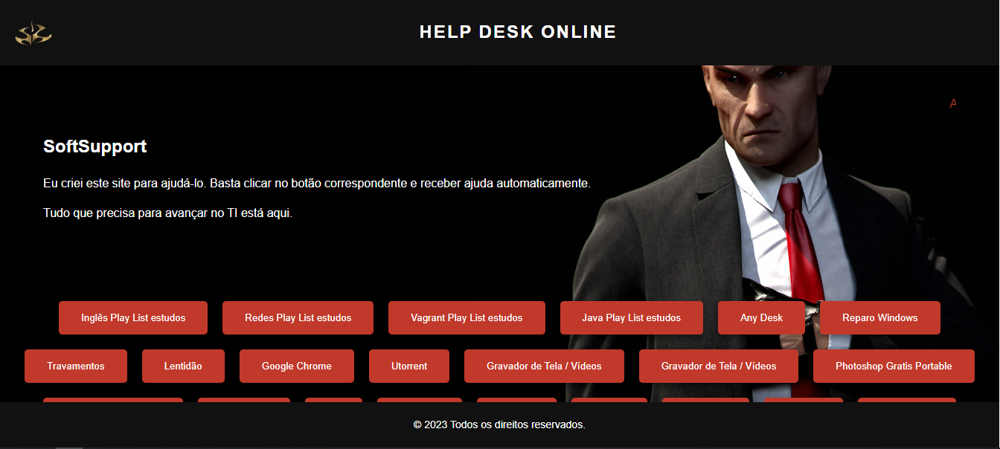
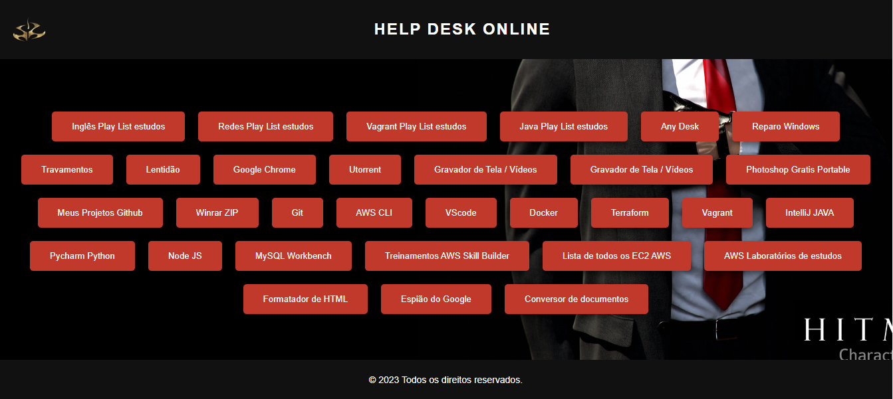

# HelpDeskOnline
## Um site de analista de suporte para ajudar a quem precisa

Já pensou clicar e deixar resolver tudo o que você precisa?

Help Desk Online é um sistema para resolução de problemas de TI de forma remota, sem a necessidade de um técnico ir até o usuário. Ele foi criado para ajudar na instalação de softwares e resolução de problemas em computadores de forma simples e rápida. O sistema é acessado através de um website e as ações são executadas automaticamente.

<h2>Tecnologias Utilizadas</h2>

As seguintes tecnologias foram utilizadas para o desenvolvimento deste projeto:

-  HTML
-  CSS
-  JavaScript

# Como usar

 Para utilizar o sistema, basta acessar o website e escolher a opção desejada na página inicial. As opções disponíveis são: 

* Só abrir a página index

# Requisitos

 Para utilizar o sistema, é necessário ter um navegador web atualizado e uma conexão com a internet. 

# Contribuição

Contribuições são sempre bem-vindas! Se você deseja contribuir para este projeto, por favor, crie um fork do repositório, faça suas modificações e envie um pull request.

# Licença

Este projeto é distribuído sob a licença MIT. Consulte o arquivo LICENSE para mais informações.

